# Runaway Brewery - Portfolio Project 5 - Full Stack Software Development (E-commerce Applications)

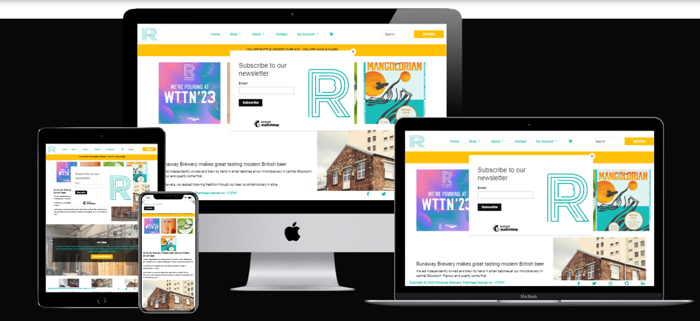

## Live Site

<https://runawaybrewery-d81d6b05c59f.herokuapp.com/>

## Repository

<https://github.com/Kieran132/Runaway>

## Contents

- Project Goals
- UXD - User Experience Design
- Existing Features
 - Home Page
 - Shop
 - About
  - Taproom & Bottle Shop
  - Plan Your Visit
  - Book A Tour
  - Delivery and Collection
  - Trade
 - Contact
 - My Account
  - Log In/ Log Out
  - Sign uUp
  - My Profile
  - Wishlist
 - Shopping bag
 - Checkout
- Technologies Used
- Testing
- Deployment
- Credits

---

## Project Goals

Runaway Brewery is my fifth project as part of the Code Institute Full Stack Web Developer Course.

Runaway Brewery is an already existing company that has been trading for over 6 years now and has currently moved into a bigger premises, so expanding in both customer facing trade and also cask/keg selling trade. They came to me and asked if I could revap their current website as they used spotify templating and was not to their like or design.
With this app the user get a brief intro in the style of beer runaway make and a brief introduction to their ethos and what they do. Further into the app, the user is able to purchase the beer through a working checkout, the user can find more information about the brewery and where to find them, they are able to book tours with which the email is sent to both the logged in user and Runaway itself. In addition to this, the user has a profile which shows previous purchase history and enables the user to add products to their wishlist for future reference.

---

## UXD - User Experience Design

When designing and creating this project it was important to keep the user experience at the forefront of everything. This was achieved by breaking the project down into 5 planes;

- The Strategy Plane
- The Scope Plane
- The Structure Plane
- The Skeleton Plane
- The Surface Plane

---

## Strategy Plane

In this design phase, I had discussion with the people at Runaway Brewery to outline what sort of app they were looking for. We discussed colours, ease of use and what type on information should be accessible.

<u> Prodject Objectives </u>

- Take their existing website as reference
- Apply clean, more personal design to their website
- Allows for CRUD functionality for admin users

<u> Users and User Needs </u>

- Beer lovers looking for their next place to visit
- Easy and simple navigation through the app
- Simple understanding of what the app is about and its uses

---

## Scope Plane

For the Scope Plane, I outlined the features I think would best suit the project and the design. With this I relayed this back to Runaway for feedback and any changes they wanted to make.

<u> Features </u>

- Homepage
- Shop - allowed for filtering and searching
- Abouts page - covered all information about Runaway and ability to Book a Tour
- Contact Page
- Accounts tab - allowed for user profile, wishlist
- Authentication levels throughout the website depending on the user

---

## Structure Plane

Here at the Structure Plane, this is where I outlined the design colours, fonts and the building blocks of the project

<u> Colors </u>

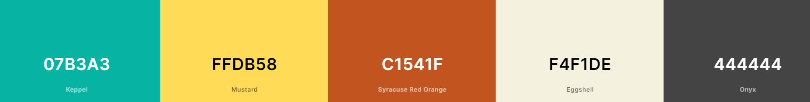

The main color that wanted to be used was Keppel, as this was the main color used within the logo of Runaway. This color is used for the logo, the nav bar heading tabs and the information in the footer.
To contrast this blue-ish color, I went for a yellow/mustard as main button color and also the background for the banner on the hompage. This color is very bold and eyecatching. 
For button hover color the red orange I thought contrasted very well with the yellow as it is inline with eachother
For the main background color of body, header and footer the Eggshell was used. This was because its slight off white which helps make all the other colors stand out and not clash.

<u> Fonts </u>

For H1, H2 tags I decided to use Oswald. I feel it is very clean, crisp looking font

For the body of the project I decided to use Roboto. It is very similar to Oswald but I felt that it was better suited for body of the app.

<u> Key Models </u>

-  User Authentication

- Allauth creates user profile and determins the depth of authentication within the app

- Appointment
    
    - Allows only signed in user to be able to book a tour around the brewery
    - Upon submission, time is saved and removed from any other users selecting that time
    - Email is sent to both the users email and Runaway

- Checkout

    - Allows any user to process payment of their chosen purchased items
    - Shows item added to bag within the shopping cart

- Contact

    - Shows user contact form which submits the form and information is sent to Runaway

- Wishlist

    - Allows for users to add products to their own wishlist page for future reference
    - These can be deleted by the user

- Profile

    - Profile is created with the users information which is used around the app
    - The user can update and amend their profile

- Shop

    - Shows all the products that Runaway has to offer
    - Authorised admin are able to add, edit and delete products without using the admin panel
    - User can sort items within the shop 
    - Ability to select only certain products, instead of viewing all of them

---

## Skeleton Plane

#### Home Page

From the beginning, I wanted the home page to be a certain way and have similarities to the home page Runaway already has as I felt this is something they liked and wanted. I wanted to add some images of the products they have recently created at the top of the page to showcase to people visiting the app. Then following down the page add brief and informative text about Runaway. Keeping the page vibrant, engaging and also to the point.

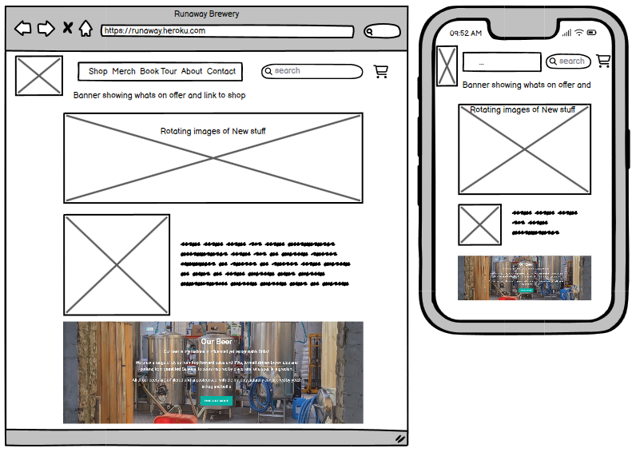

#### Shop Page 

I wanted this page to be simple, clear and easy for the user. I felt there is nothing more annoying than having a page that is difficult to navigate and use for a simple task. Therefore, I went for a 3 row layout for the products within a card tag with image, title of the product, a button to take the user a detail page and the price.

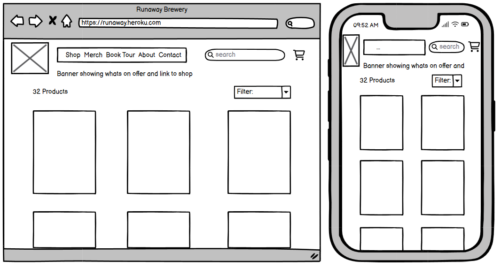

#### Contact Page

For the contact page, I wanted to create a simple form that was easy to understand for the user and one which allowed the user to submit only the neccessary field - name, email address and message. In addition, I wanted to add google maps function so the user could physically see the location of Runaway

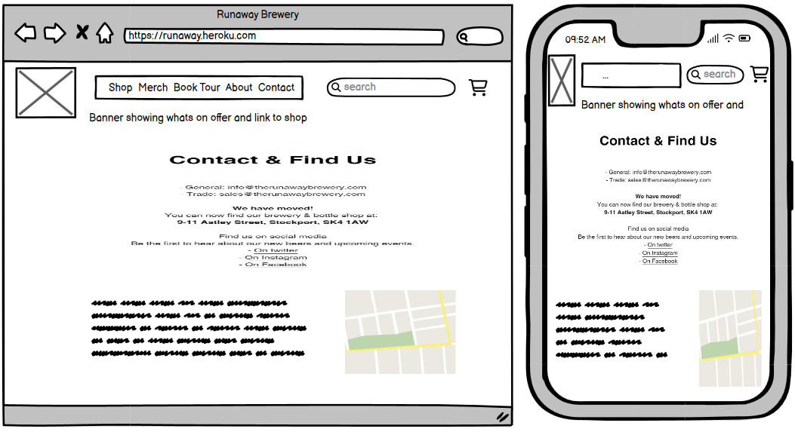

#### About Page

For this page, I decided to keep all the information about Runaway all in one easily accessible tab, that broke down into different areas. Most of this information would come from the already existing website as this is what they wanted.

#### Booking Page

Runaway offer tours around their brewery to the public, however this is done via an external company using their product and api, which mean added costs. I felt it would be easier and more efficient to keep this all in house and for the app to do the work for them without them having to out-source this. I wanted very simple and easy way of booking that sent out relevant information to both parties.

---

## Surface Plane

#### Navigation Bar

- Is implemented throughout the whole app on all screen sizes
- Easy to use and understand

#### Footer

- Inline with the style of navbar
- Clean, minimal looking
- Has Social media links to Runaways media pages via a new tab

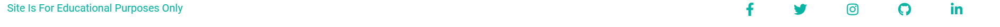

#### Home Page

- User engagement with pictures of products
- Brief outline of the philosophy of Runaway and image of their new premises
- Find out more button for users wanting to know more
- Bottom of the page, more images to be more engaging with the user

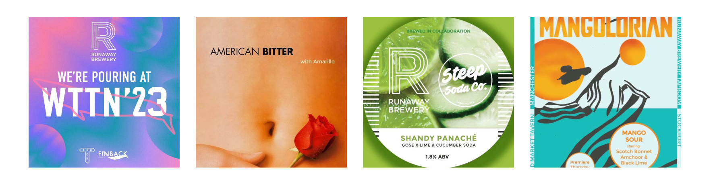
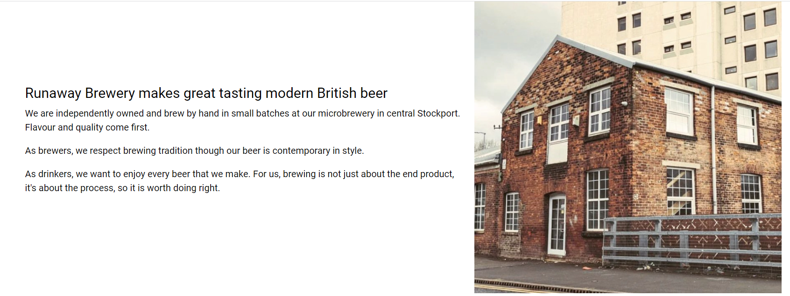

#### Shop Page

- Products are even in size and position
- Clear and easy to understand what the products are
- Easy to navigate to more detail page with big colorful button
- Under sort dropdown, clearly shows how many items on the page

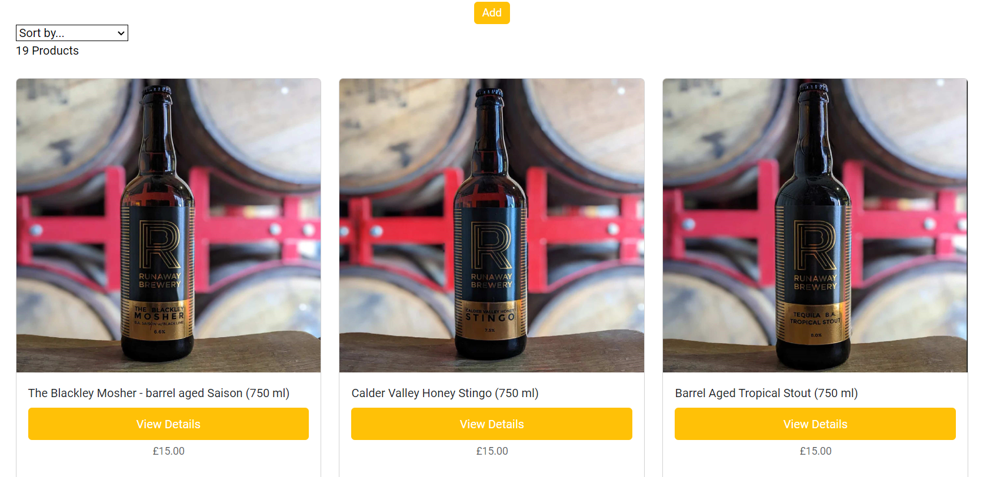

#### Pop Up Messages

- Throughout the project the User is prompted by certain pop up messages depending on the task they have done

Updating product quantity in bag

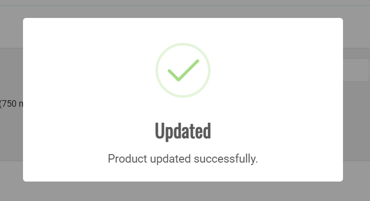

When an item is added to the Users bag

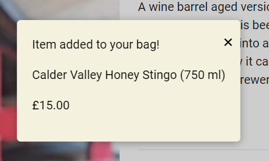

#### Shopping Bag Page

- Information is displayed to the user clearly in a table
- Clear hints on what the user can do, for exmplae update/delete buttons two different colors 
- Bright yellow button, following the theme, prompting the user to go to checkout

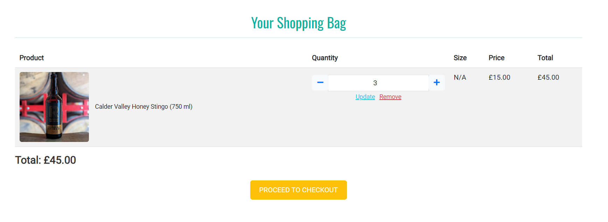

#### Booking Page

- Very simple page which outlines what they user has to do
- Upon submission both User and Runaway both recieve an email confirmation and also the User will be taken to booking success page

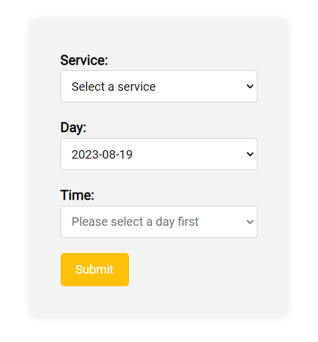

---

## Technologies Used

- Python
    - asgiref==3.7.2
    - boto3==1.28.17
    - botocore==1.31.17
    - cloudinary==1.33.0
    - dj-database-url==0.5.0
    - dj3-cloudinary-storage==0.0.6
    - Django==3.2.19
    - django-allauth==0.41.0
    - django-countries==7.2.1
    - django-crispy-forms==1.14.0
    - django-storages==1.13.2
    - gunicorn==20.1.0
    - jmespath==1.0.1
    - oauthlib==3.2.2
    - Pillow==9.5.0
    - psycopg2==2.9.6
    - python3-openid==3.2.0
    - pytz==2023.3
    - requests-oauthlib==1.3.1
    - s3transfer==0.6.1
    - sqlparse==0.4.4
    - stripe==5.4.0
    - urllib3==1.26.16
- HTML
- CSS
- Bootstrap
- JavaScript
- SweetAlert
- Font Awsome
- MailChimp
- Google Fonts
- Git
- Github
- Gitpod
- Google Developer Tools
- Balsamiq
- Stripe
- AWS
- Widg.io - age verification widget

---

## Browsers used to view the app

- Chrome
- Firefox
- Safari
- Edge

---

## Testing

Please click the link below to see the testing document

[Testing](/TESTING.md)

---

## Deployment

Code Institue provided the tempate that was used to create the project

[Code Institute Gitpod Full Template](https://github.com/Code-Institute-Org/gitpod-full-template)

- Click the 'Use This Template' button
- Give your new repository a name
- Click 'Create Repository from Template'. This creates your new repository
- Click the green 'Gitpod' button. This will open a new gitpod workspace
- If using gitpod, ensure the workspace is pinned and you only open this once workspace
- To commit any work you do, simply follow these steps:
        - `git add .` 
        - `git commit -m "Add a short messaged explaining your commit"`
        - `git push`

#### Requirements

- Python 3
- Pip
- Git
- AWS S3

#### Creating a Clone

- On the repository, click Code
- In the Clone >> HTTPS section, copy the clone URL for the repository
- In your local IDE open Git Bash
- You will have to change the working directory based on where you want the clone directory to be made
- In the terminal type: `git clone`, then paste in the URL from step 2
- In the env.py file, make sure you have these values:
        
        import os

        os.environ.setdefault("SECRET_KEY", "<app secret key of your choice>")
        os.environ.setdefault("DEVELOPMENT", "True")
        os.environ.setdefault('STRIPE_PUBLIC_KEY', '<key generated by Stripe>')
        os.environ.setdefault('STRIPE_SECRET_KEY', '<key generated by Stripe>')
        os.environ.setdefault('STRIPE_WH_SECRET', '<key generated by Stripe>')

- Stripe Keys are generated by Stripe with each user account having their own unique key

- Install project requirements - `pip3 install requirements.txt`
- Migrate the database - `python3 manage.py migrate`
- Create a superuser - `python3 manage.py createsuperuser`
- To see the cloned project, in the terminal type: `python3 manage.py runserver`

#### Heroku Deployment

- Create a Heroku account, or, Sign in if you already have one
- Click New App Button
- In the Resources tab, search for Heroku Postgre and add to your project
- dj_database_url and pyscopg2 need to be installed:

                pip3 install dj_database_url
                pip3 install psycopg2

- Log into Heroku CLI - `heroku login -1`
- Run migrations - ` heroku run python3 manage.py migrate`
- Create a Superuser - `python3 manage.py createsuperuser`
- Install gunicorn - `pip3 install gunicorn`
- Create a file called requirements.txt - ` pip3 freeze > requirements.txt`
- Create a Procfile with this code inside it (notice the captical P!!)
        
        web: gunicorn (your_apps_name).wsgi:application

- Disable Heroku from collectiong static files - ` heroku config:set DISABLE_COLLECTSTATIC=1 -- <app-name>`
- Add the host name to the project settings.py file

        ALLOWED_HOSTS = ['<app-name>.herokuapp.com', 'localhost']

- Connect Heroku to you Github, by selecting Github as the deployment method and search for the github repository and pressing connect
- In Heroku, within settings, under config vars select Reveal config vars
- Add the following,

        AWS_ACCESS_KEY_ID =	<your variable here>
        AWS_SECRET_ACCESS_KEY =	<your variable here>
        DATABASE_URL =	<added by Heroku when Postgres installed>
        DISABLE_COLLECTSTATIC =	1 
        EMAIL_HOST_PASS = <your variable here>
        EMAIL_HOST_USER = <your variable here>
        SECRET_KEY = <your variable here>
        STRIPE_PUBLIC_KEY = <your variable here>
        STRIPE_SECRET_KEY = <your variable here>
        STRIPE_WH_SECRET = <different from env.py>
        USE_AWS = True
- Go back to the Deploy tab and under Automatic deploys choose Enable Automatic Deploys
- Back in your CLI add, commit and push your changes and Heroku will automatically deploy your app
        
        git add .
        git commit -m "Initial commit"
        git push

- Your deployed site can be launched by clicking Open App from its page within Heroku.

AWS S3 Bucket setup

- Create an Amazon AWS account
- Search for S3 and create a new bucket
        - Allow public access
- Under Properties > Static website hosting
        - Enable
        - index.html as index.html
        - save
- Under Permissions > CORS use the following:

        [
         {
                "AllowedHeaders": [
                        "Authorization"
                ],
                "AllowedMethods": [
                        "GET"
                ],
                "AllowedOrigins": [
                        "*"
                ],
                "ExposeHeaders": []
         }
        ]

- Under Permissions > Bucket Policy:
        - Generate Bucket Policy and take note of Bucket ARN
        - Chose S3 Bucket Policy as Type of Policy
        - For Principal, enter *
        - Enter ARN noted above
        - Add Statement
        - Generate Policy
        - Copy Policy JSON Document
        - Paste policy into Edit Bucket policy on the previous tab
        - Save changes
- Under Access Control List (ACL):
        - For Everyone (public access), tick List
        - Accept that everyone in the world may access the Bucket
        - Save changes

AWS IAM (Identity and Access Management) setup:

- From the IAM dashboard within AWS, select User Groups:
        - Create a new group
        - Click through and Create Group
- Select Policies:
        - Create policy
        - Under JSON tab, click Import managed policy
Choose AmazongS3FullAccess
        - Edit the resource to include the Bucket ARN noted earlier when creating the Bucket Policy
        - Click next step and go to Review policy
        - Give the policy a name and description of your choice
        - Create policy
- Go back to User Groups and choose the group created earlier
        - Under Permissions > Add permissions, choose Attach Policies and select the one just created
        - Add permissions
-       - Under Users:
        - Choose a user name
        - Select Programmatic access as the Access type
        - Click Next
        - Add the user to the Group just created
        - Click Next and Create User
- Download the .csv containing the access key and secret access key.
        - THE .csv FILE IS ONLY AVAILABLE ONCE AND CANNOT BE DOWNLOADED AGAIN.

Connecting Heroku to AWS S3

- Install boto3 and django-storages

        pip3 install boto3
        pip3 install django-storages
        pip3 freeze > requirements.txt
        
- Add the values from the .csv you downloaded to your Heroku Config Vars under Settings:
- Delete the DISABLE_COLLECTSTATIC variable from your Cvars and deploy your Heroku app
- With your S3 bucket now set up, you can create a new folder called media (at the same level as the newly added static folder) and upload any required media files to it.
        - PLEASE MAKE SURE media AND static FILES ARE PUBLICLY ACCESSIBLE UNDER PERMISSIONS

## Credits

#### Products

- All the products came from Runaways existing website 

[Runaway Website](https://www.therunawaybrewery.com/)

#### Code

- Alot of the new features for an E-Commerce website (checkout, profile, bag, payment, AWS) I followed came from Code Institute walkthrough project, [Boutique Ado](https://github.com/Code-Institute-Solutions/boutique_ado_v1/blob/933797d5e14d6c3f072df31adf0ca6f938d02218/boutique_ado/settings.py)
- Adding the ability to have newsletter sign up came from MailChimp 
        [MailChimp](https://mailchimp.com/?currency=GBP)

- Age Verification came from Widg.io 
        [Widg Age Verification](https://www.widg.io/)

- The building block to enable the user to book a tour came from 
        [How to book a tour](https://blog.devgenius.io/django-tutorial-on-how-to-create-a-booking-system-for-a-health-clinic-9b1920fc2b78)

- Code Intitute Tutors helped iron out parts of the code that I was not able to sort out myself

#### Django Documentation

- Any issues involving django, I referenced their online documentation to guide me through step by step 
        [Django Documentation](https://docs.djangoproject.com/en/4.2/)

#### Bootstrap

- The styling format came from the Bootstrap library throughout the website. This is in the from of navigation bar, collapsed navigation bar, cards for all products, button designs and froms
        [Bootstrap](https://getbootstrap.com/docs/5.3/getting-started/introduction/)

#### SweetAlert

- This was a new framework I sourced in order to provide a more friendly user experience for pop up messages.
        [SweetAlert](https://sweetalert.js.org/docs/)

#### AWS

- Any issues I had with AWS I looked at their documentation for help
        [AWS](https://aws.amazon.com/)

#### Stripe

- This was used with the help of their documention to allow users to purchase products
        [Stripe](https://stripe.com/gb)

